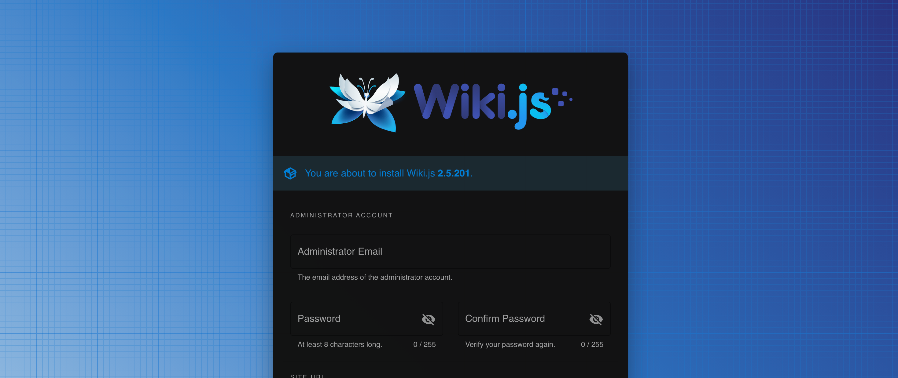

# Sample codes for wiki.js

## How to use
Run ```docker-compose up```

Then, access [Wiki.js Setup page](http://localhost:3000)



## Customize docker-compose.yml
As you can see, the entry command ```node server``` after ```sleep 60``` comes from [Dockerfile of requarks/wiki](https://github.com/Requarks/wiki/blob/dev/dev/build/Dockerfile)

## Trouble shooting
When something wrong in db container, it's recommended to remove it. To remove the db volume, ```docker volume rm wikijs_db-store```

## Future works
 - [ ] Launch as soon as db container is ready instead of waiting 60 seconds for every launching.

## Reference
[docker-compose MySQL8.0 のDBコンテナを作成する](https://qiita.com/ucan-lab/items/b094dbfc12ac1cbee8cb)
[DockerのMySQLに初期データを投入する](https://noumenon-th.net/programming/2019/04/01/docker-entrypoint-initdb01/)
[Compose における起動順の制御](https://docs.docker.jp/compose/startup-order.html)
